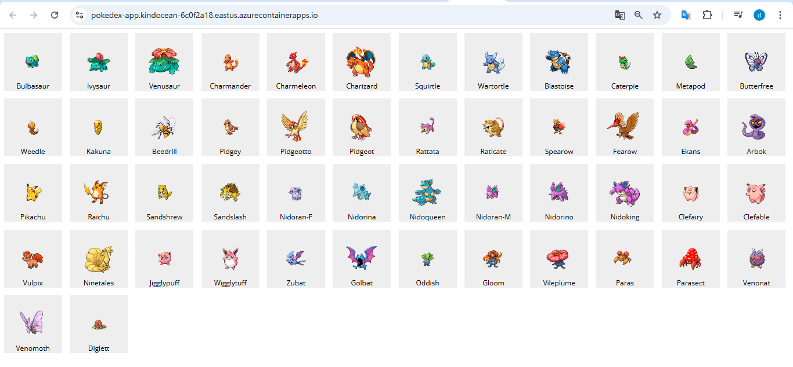
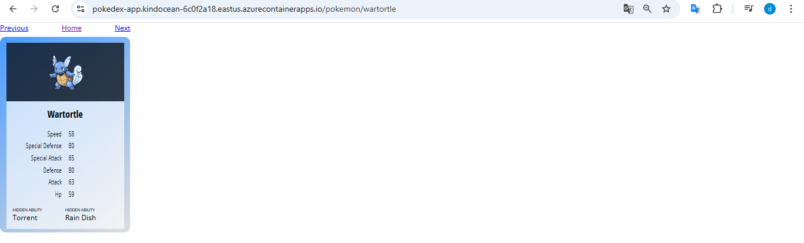
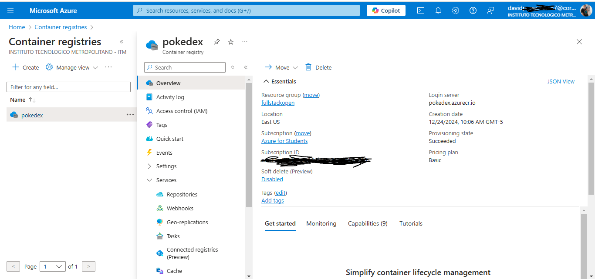
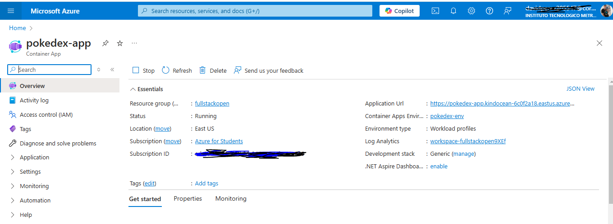
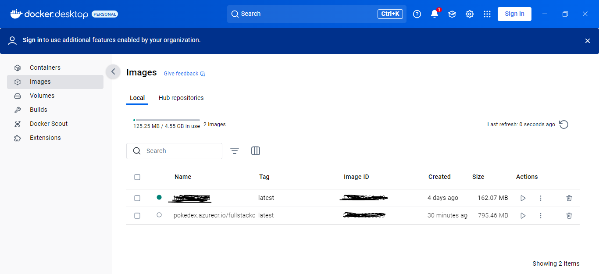

# Full Stack open CI/CD

This repository is used for the CI/CD module of the Full stack open course

Fork the repository to complete course exercises

## Full Stack Open Pokedex Deployment on Azure

### Description

I deployed a full-stack application built with **Node.js** for the backend and **React** for the frontend to **Azure Container Apps**. This deployment leverages various Azure services to ensure scalability, security, and efficient resource management. The application is currently accessible at [Pokedex Azure Deployment](https://pokedex-app.kindocean-6c0f2a18.eastus.azurecontainerapps.io), though the URL is temporarily inactive to conserve Azure credits.





## Azure Services Used

- **Azure Container Registry (ACR):** A private Docker registry for storing and managing container images.



- **Azure Container Apps:** A fully managed serverless container service for deploying and managing containerized applications.



- **Azure Resource Group:** A container that holds related Azure resources for the solution.
- **Azure CLI:** A command-line tool to manage Azure resources.

## Deployment Steps

### Build the Docker Image

First, I built the Docker image for my application and tagged it with my Azure Container Registry (ACR) name.



```bash
docker build -t pokedex.azurecr.io/fullstackopen-cicd:latest .
```

### Login to Azure and ACR

I authenticated my local Docker CLI with Azure and my ACR to allow pushing the image.

```bash
az login
az acr login --name pokedex
```

### Push the Docker Image to ACR

After logging in, I pushed the Docker image to my ACR.

```bash
docker push pokedex.azurecr.io/fullstackopen-cicd:latest
```

### Create a Container App Environment

I created a Container App environment which serves as a logical boundary for my container apps.

```bash
az containerapp env create --name pokedex-env --resource-group fullstackopen --location eastus
```

### Create the Container App

Using the pushed image, I created the Container App.

```bash
az containerapp create \
  --name pokedex-app \
  --resource-group fullstackopen \
  --environment pokedex-env \
  --image pokedex.azurecr.io/fullstackopen-cicd:latest \
  --target-port 3000 \
  --ingress external \
  --registry-server pokedex.azurecr.io \
  --registry-username pokedex \
  --registry-password <YOUR_REGISTRY_PASSWORD> \
  --min-replicas 0 \
  --max-replicas 1
```

**Note:** Replace <YOUR_REGISTRY_PASSWORD> with the actual password from your ACR credentials.

### Verify the Deployment

I confirmed that the deployment was successful by checking the provisioning state.

```bash
az containerapp show --name pokedex-app --resource-group fullstackopen --query "properties.provisioningState" --output table
```

### The expected output should be:

```markdown
provisioningState
-----------------
Succeeded
```

#### Live Application URL

https://pokedex-app.kindocean-6c0f2a18.eastus.azurecontainerapps.io

#### Author: David Pérez

**Note:** The application URL is currently inactive to conserve Azure credits